# 概览 

## HTML5文档类型

```html
    <!DOCTYPE html>
    <html lang="zh-CN">
    ...
    </html>
```
## 移动设备优先

**name="viewport"**
```html
   <meta name="viewport" content="width=device-width, initial-scale=1">
```
## 布局容器
```html
<div class="container">
  ...
</div>
```
**.container-fluid 类用于 100% 宽度，占据全部视口（viewport）的容器**
```html
<div class="container-fluid">
  ...
</div>
```

# 栅格系统
Bootstrap 提供了一套响应式、移动设备优先的流式栅格系统
## 简介
---
1. 行：row, 在水平方向创建一组**列（column）**
1. 列：col, 每一行自动划分 12 列

## 栅格参数
1. 超小屏幕 手机        **（<768px）**      xs
1. 小屏幕  平板         **（>=768px）**     sm
1. 中等屏幕 桌面显示器   **（>=992px）**     md
1. 大屏幕 大桌面显示器   **（>=1200px）**    lg

详细查看 Bootstrap 的栅格系统是如何在多种屏幕设备上工作的:

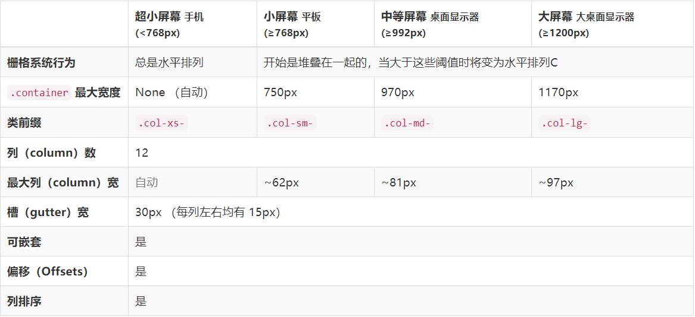

## 实例：从堆叠到水平排列
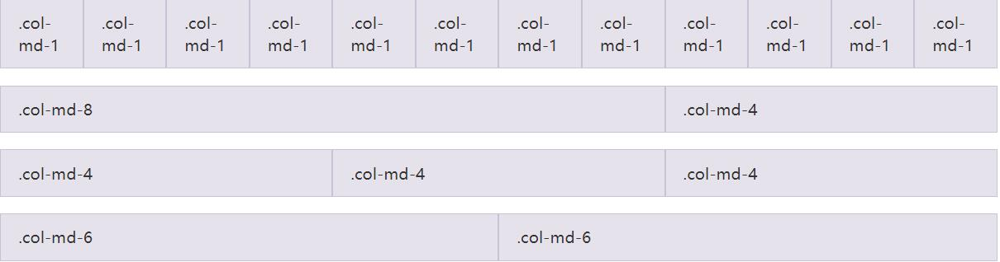

```html {.line-numbers}
<div class="row ">
  <div class="col-md-1">.col-md-1</div>
  <div class="col-md-1">.col-md-1</div>
  <div class="col-md-1">.col-md-1</div>
  <div class="col-md-1">.col-md-1</div>
  <div class="col-md-1">.col-md-1</div>
  <div class="col-md-1">.col-md-1</div>
  <div class="col-md-1">.col-md-1</div>
  <div class="col-md-1">.col-md-1</div>
  <div class="col-md-1">.col-md-1</div>
  <div class="col-md-1">.col-md-1</div>
  <div class="col-md-1">.col-md-1</div>
  <div class="col-md-1">.col-md-1</div>
</div>
<div class="row">
  <div class="col-md-8">.col-md-8</div>
  <div class="col-md-4">.col-md-4</div>
</div>
<div class="row">
  <div class="col-md-4">.col-md-4</div>
  <div class="col-md-4">.col-md-4</div>
  <div class="col-md-4">.col-md-4</div>
</div>
<div class="row">
  <div class="col-md-6">.col-md-6</div>
  <div class="col-md-6">.col-md-6</div>
</div>
```
## 多余的列（column）将另起一行排列
```html  {.line-numbers}
<div class="row">
  <div class="col-xs-9">.col-xs-9</div>
  <div class="col-xs-4">.col-xs-4<br>Since 9 + 4 = 13 &gt; 12, this 4-column-wide div gets wrapped onto a new line as one contiguous unit.</div>
  <div class="col-xs-6">.col-xs-6<br>Subsequent columns continue along the new line.</div>
</div>
```
## 响应式列重置
* .clearfix 
## 列偏移
* .col-md-offset-4   {>>为当前元素向右移动 4 个单位列宽<<}

```html  {.line-numbers}

<div class = "container">
    <div class="row">
      <div class="col-sm-9">
       占9列
        <div class="row">
          <div class="col-xs-8 col-sm-6">
            Level 2: .col-xs-8 .col-sm-6
          </div>
          <div class="col-xs-4 col-sm-6">
            Level 2: .col-xs-4 .col-sm-6
          </div>
        </div>
      </div>
    </div>
</div>
```

## 列排序
* col-md-push-3     从**左 => 右**偏移 3 列
* col-md-pull-3     从**右 => 左**偏移 3 列


#  排版

```html  {.line-numbers}
<p class="text-left">Left aligned text.</p>
<p class="text-center">Center aligned text.</p>
<p class="text-right">Right aligned text.</p>
<p class="text-justify">Justified text.</p>
<p class="text-nowrap">No wrap text.</p>
```

## 对齐

## 标题 

**与html  {.line-numbers}原生写法相同**

* h1 ~ h6

### 被删除的文本 

* del 标签
### 无用文本

*  s 标签
### 带下划线的文本

* u 标签
### 小号文本

* small

# 代码

# 表格

## 基本实例
```html  {.line-numbers}
<table class="table">
  ...
</table>
```
## 条纹状表格
* .table-striped
## 鼠标悬停

* table-hover
## 响应式表格

* 将任何 .table 元素包裹在 .table-responsive 元素内，即可创建响应式表格

# 表单

## 基本实例
* 单独的表单控件会被自动赋予一些全局样式。所有设置了 .form-control 类的 &lt;input&gt;、&lt;textarea&gt;和 &lt;select&gt; 元素都将被默认设置宽度属性为 width: 100%;。 将 label 元素和前面提到的控件包裹在 .form-group 中可以获得最好的排列。

```html  {.line-numbers}

<form>
  <div class="form-group">
    <label for="exampleInputEmail1">Email address</label>
    <input type="email" class="form-control" id="exampleInputEmail1" placeholder="Email">
  </div>
  <div class="form-group">
    <label for="exampleInputPassword1">Password</label>
    <input type="password" class="form-control" id="exampleInputPassword1" placeholder="Password">
  </div>
  <div class="form-group">
    <label for="exampleInputFile">File input</label>
    <input type="file" id="exampleInputFile">
    <p class="help-block">Example block-level help text here.</p>
  </div>
  <div class="checkbox">
    <label>
      <input type="checkbox"> Check me out
    </label>
  </div>
  <button type="submit" class="btn btn-default">Submit</button>
</form>
```

## 内联表单
* 为 &lt;form&gt;元素添加  .form-inline 
* 可能需要手动设置宽度
* 一定要添加 label 标签

1. 内联表单实例1: 

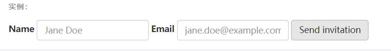

```html  {.line-numbers}
<form class="form-inline">
  <div class="form-group">
    <label for="exampleInputName2">Name</label>
    <input type="text" class="form-control" id="exampleInputName2" placeholder="Jane Doe">
  </div>
  <div class="form-group">
    <label for="exampleInputEmail2">Email</label>
    <input type="email" class="form-control" id="exampleInputEmail2" placeholder="jane.doe@example.com">
  </div>
  <button type="submit" class="btn btn-default">Send invitation</button>
</form>
```

2. 内联表单实例2

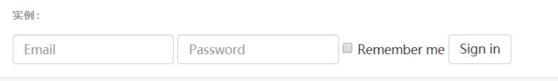
```html  {.line-numbers}
<form class="form-inline">
  <div class="form-group">
    <label class="sr-only" for="exampleInputEmail3">Email address</label>
    <input type="email" class="form-control" id="exampleInputEmail3" placeholder="Email">
  </div>
  <div class="form-group">
    <label class="sr-only" for="exampleInputPassword3">Password</label>
    <input type="password" class="form-control" id="exampleInputPassword3" placeholder="Password">
  </div>
  <div class="checkbox">
    <label>
      <input type="checkbox"> Remember me
    </label>
  </div>
  <button type="submit" class="btn btn-default">Sign in</button>
</form>
```
3.  内联表单实例3

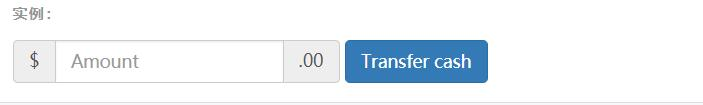
```html  {.line-numbers}
<form class="form-inline">
  <div class="form-group">
    <label class="sr-only" for="exampleInputAmount">Amount (in dollars)</label>
    <div class="input-group">
      <div class="input-group-addon">$</div>
      <input type="text" class="form-control" id="exampleInputAmount" placeholder="Amount">
      <div class="input-group-addon">.00</div>
    </div>
  </div>
  <button type="submit" class="btn btn-primary">Transfer cash</button>
</form>
```
## 水平排列的表单
* 通过为表单添加 .form-horizontal 类，并联合使用 Bootstrap 预置的栅格类，可以将 label 标签和控件组水平并排布局。这样做将改变 .form-group 的行为，使其表现为栅格系统中的行（row）
* 无需再额外添加 .row 

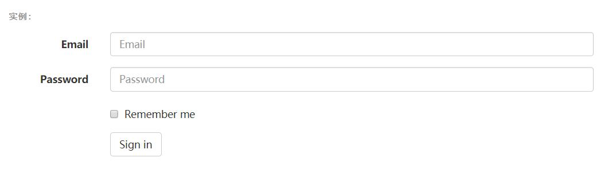

* code
```html  {.line-numbers}
<form class="form-horizontal">
  <div class="form-group">
    <label for="inputEmail3" class="col-sm-2 control-label">Email</label>
    <div class="col-sm-10">
      <input type="email" class="form-control" id="inputEmail3" placeholder="Email">
    </div>
  </div>
  <div class="form-group">
    <label for="inputPassword3" class="col-sm-2 control-label">Password</label>
    <div class="col-sm-10">
      <input type="password" class="form-control" id="inputPassword3" placeholder="Password">
    </div>
  </div>
  <div class="form-group">
    <div class="col-sm-offset-2 col-sm-10">
      <div class="checkbox">
        <label>
          <input type="checkbox"> Remember me
        </label>
      </div>
    </div>
  </div>
  <div class="form-group">
    <div class="col-sm-offset-2 col-sm-10">
      <button type="submit" class="btn btn-default">Sign in</button>
    </div>
  </div>
</form>
```

## 文本域
* 支持多行文本的表单控件。可根据需要改变 rows 属性

```html  {.line-numbers}
<textarea class="form-control" rows="3"></textarea>
```

## 多选和单选框

### 默认外观（堆叠在一起）

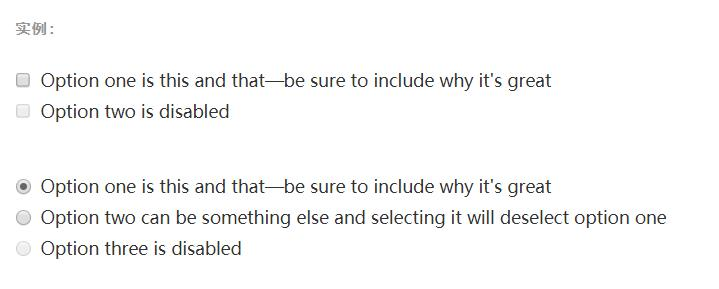


```html  {.line-numbers}
<div class="checkbox">
  <label>
    <input type="checkbox" value="">
    Option one is this and that&mdash;be sure to include why it's great
  </label>
</div>
<div class="checkbox disabled">
  <label>
    <input type="checkbox" value="" disabled>
    Option two is disabled
  </label>
</div>

<div class="radio">
  <label>
    <input type="radio" name="optionsRadios" id="optionsRadios1" value="option1" checked>
    Option one is this and that&mdash;be sure to include why it's great
  </label>
</div>
<div class="radio">
  <label>
    <input type="radio" name="optionsRadios" id="optionsRadios2" value="option2">
    Option two can be something else and selecting it will deselect option one
  </label>
</div>
<div class="radio disabled">
  <label>
    <input type="radio" name="optionsRadios" id="optionsRadios3" value="option3" disabled>
    Option three is disabled
  </label>
</div>
```

### 内联---单选和多选框

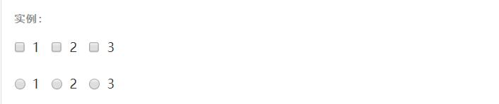

* code:
```html  {.line-numbers}
<label class="checkbox-inline">
  <input type="checkbox" id="inlineCheckbox1" value="option1"> 1
</label>
<label class="checkbox-inline">
  <input type="checkbox" id="inlineCheckbox2" value="option2"> 2
</label>
<label class="checkbox-inline">
  <input type="checkbox" id="inlineCheckbox3" value="option3"> 3
</label>

<label class="radio-inline">
  <input type="radio" name="inlineRadioOptions" id="inlineRadio1" value="option1"> 1
</label>
<label class="radio-inline">
  <input type="radio" name="inlineRadioOptions" id="inlineRadio2" value="option2"> 2
</label>
<label class="radio-inline">
  <input type="radio" name="inlineRadioOptions" id="inlineRadio3" value="option3"> 3
</label>
```

## 校验状态


* Bootstrap 对表单控件的校验状态，如 error、warning 和 success 状态，都定义了样式。使用时，添加 .has-warning、.has-error 或 .has-success 类到这些控件的父元素即可。任何包含在此元素之内的 .control-label、.form-control 和 .help-block 元素都将接受这些校验状态的样式。

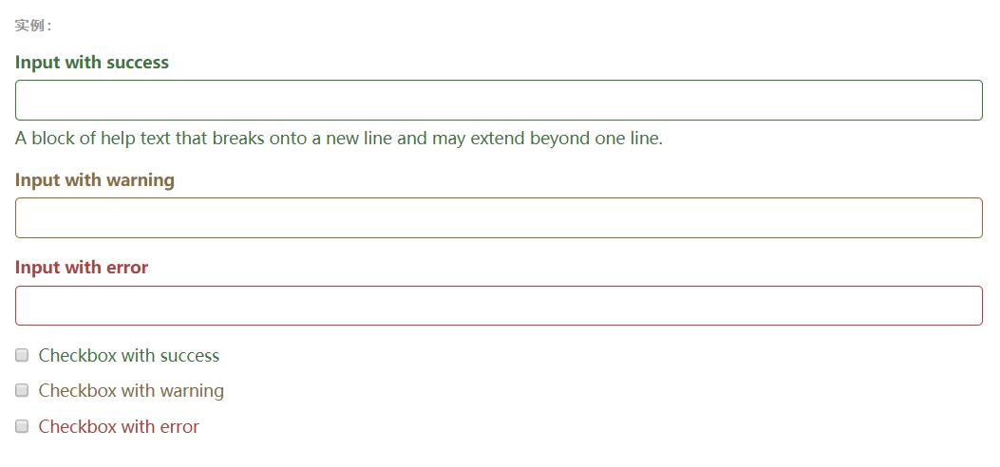

* code
```html  {.line-numbers}
<div class="form-group has-success">
  <label class="control-label" for="inputSuccess1">Input with success</label>
  <input type="text" class="form-control" id="inputSuccess1" aria-describedby="helpBlock2">
  <span id="helpBlock2" class="help-block">A block of help text that breaks onto a new line and may extend beyond one line.</span>
</div>
<div class="form-group has-warning">
  <label class="control-label" for="inputWarning1">Input with warning</label>
  <input type="text" class="form-control" id="inputWarning1">
</div>
<div class="form-group has-error">
  <label class="control-label" for="inputError1">Input with error</label>
  <input type="text" class="form-control" id="inputError1">
</div>
<div class="has-success">
  <div class="checkbox">
    <label>
      <input type="checkbox" id="checkboxSuccess" value="option1">
      Checkbox with success
    </label>
  </div>
</div>
<div class="has-warning">
  <div class="checkbox">
    <label>
      <input type="checkbox" id="checkboxWarning" value="option1">
      Checkbox with warning
    </label>
  </div>
</div>
<div class="has-error">
  <div class="checkbox">
    <label>
      <input type="checkbox" id="checkboxError" value="option1">
      Checkbox with error
    </label>
  </div>
</div>
```

## 调整列（column）尺寸

* 用栅格系统中的列（column）包裹输入框或其任何父元素，都可很容易的为其设置宽度。

```html  {.line-numbers}
<div class="row">
  <div class="col-xs-2">
    <input type="text" class="form-control" placeholder=".col-xs-2">
  </div>
  <div class="col-xs-3">
    <input type="text" class="form-control" placeholder=".col-xs-3">
  </div>
  <div class="col-xs-4">
    <input type="text" class="form-control" placeholder=".col-xs-4">
  </div>
</div>
```

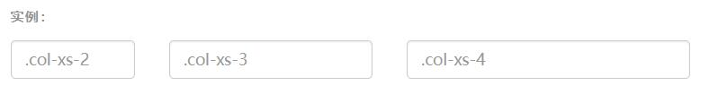
```html  {.line-numbers}
<div class="row">
  <div class="col-xs-2">
    <input type="text" class="form-control" placeholder=".col-xs-2">
  </div>
  <div class="col-xs-3">
    <input type="text" class="form-control" placeholder=".col-xs-3">
  </div>
  <div class="col-xs-4">
    <input type="text" class="form-control" placeholder=".col-xs-4">
  </div>
</div>
```
# 按钮

## 可作为按钮使用的标签或元素

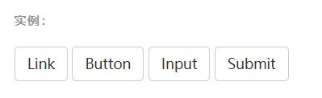

* 为 &lt;a&gt;、 &lt;button&gt;或&lt;input&gt;元素添加按钮类（button class）即可使用 Bootstrap 提供的样式。

<a class="btn btn-default" href="#" role="button">Link</a>
<button class="btn btn-default" type="submit">Button</button>
<input class="btn btn-default" type="button" value="Input">
<input class="btn btn-default" type="submit" value="Submit">

```html  {.line-numbers}
<a class="btn btn-default" href="#" role="button">Link</a>
<button class="btn btn-default" type="submit">Button</button>
<input class="btn btn-default" type="button" value="Input">
<input class="btn btn-default" type="submit" value="Submit">
```

## 预定义样式
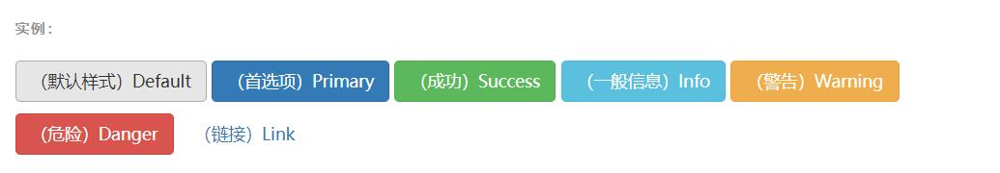

```html  {.line-numbers}
<!-- Standard button -->
<button type="button" class="btn btn-default">（默认样式）Default</button>

<!-- Provides extra visual weight and identifies the primary action in a set of buttons -->
<button type="button" class="btn btn-primary">（首选项）Primary</button>

<!-- Indicates a successful or positive action -->
<button type="button" class="btn btn-success">（成功）Success</button>

<!-- Contextual button for informational alert messages -->
<button type="button" class="btn btn-info">（一般信息）Info</button>

<!-- Indicates caution should be taken with this action -->
<button type="button" class="btn btn-warning">（警告）Warning</button>

<!-- Indicates a dangerous or potentially negative action -->
<button type="button" class="btn btn-danger">（危险）Danger</button>

<!-- Deemphasize a button by making it look like a link while maintaining button behavior -->
<button type="button" class="btn btn-link">（链接）Link</button>
```
## 尺寸

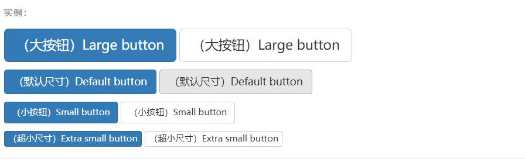

```html  {.line-numbers}
<p>
  <button type="button" class="btn btn-primary btn-lg">（大按钮）Large button</button>
  <button type="button" class="btn btn-default btn-lg">（大按钮）Large button</button>
</p>
<p>
  <button type="button" class="btn btn-primary">（默认尺寸）Default button</button>
  <button type="button" class="btn btn-default">（默认尺寸）Default button</button>
</p>
<p>
  <button type="button" class="btn btn-primary btn-sm">（小按钮）Small button</button>
  <button type="button" class="btn btn-default btn-sm">（小按钮）Small button</button>
</p>
<p>
  <button type="button" class="btn btn-primary btn-xs">（超小尺寸）Extra small button</button>
  <button type="button" class="btn btn-default btn-xs">（超小尺寸）Extra small button</button>
</p>
```


# 辅助类
---


## 情境文本颜色 

```html  {.line-numbers}
<p class="text-muted">...</p>
<p class="text-primary">...</p>
<p class="text-success">...</p>
<p class="text-info">...</p>
<p class="text-warning">...</p>
<p class="text-danger">...</p>
```

## 背景背景色

* 预定义背景色（图）

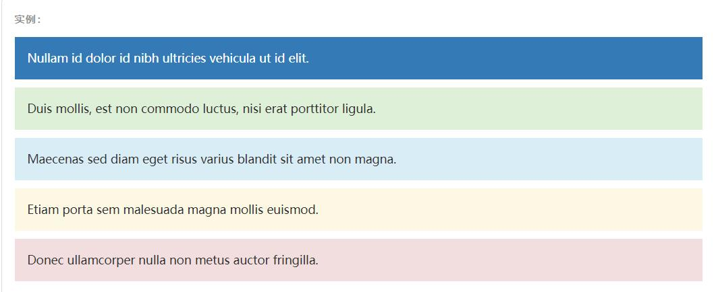

* 通用色class
1. *primary*
1. *success*
1. *info*
1. *warning*
1. *danger*

```html  {.line-numbers}
<p class="bg-primary">...</p>
<p class="bg-success">...</p>
<p class="bg-info">...</p>
<p class="bg-warning">...</p>
<p class="bg-danger">...</p>
```

## 快速浮动
```html  {.line-numbers}
<div class="pull-left">...</div>
<div class="pull-right">...</div>
```

## 让内容块 居中

```html  {.line-numbers}
<div class="center-block">...</div>
```

## 清除浮动 

* 通过为父元素添加 .clearfix 清除浮动

## 显示或隐藏内容

* .show 和 .hidden 类可以强制任意元素显示或隐藏(对于屏幕阅读器也能起效)。这些类通过 !important 来避免 CSS 样式优先级问题

```html  {.line-numbers}
<div class="show">...</div>
<div class="hidden">...</div>
```