# 组件
---

## 一、Glyphic字体图标
### 如何使用
#### 不要的其它组件混合使用

    * *应该创建一个嵌套的 &lt;span&gt; 标签，并将图标类应用到这个 <span> 标签上*
#### 不要的其它组件混合使用

    * *图标类只能应用在不包含任何文本内容或子元素的元素上*

#### 图标的可访问性
* 尤其是当图标纯粹作为装饰用途时
    *.aria-hidden="true"*
* 隐藏图标
    *.sr-only 类让其在视觉上表现出隐藏的效果。*

* 提供相应内容来表示这个控件的意图
    *.aria-label*

```html
<span class="glyphicon glyphicon-search" aria-hidden="true"></span>
```

### 实例
> 按钮、工具条中的按钮组、导航或输入框等地方

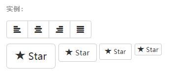

```html {.line-numbers}
<button type="button" class="btn btn-default" aria-label="Left Align">
  <span class="glyphicon glyphicon-align-left" aria-hidden="true"></span>
</button>

<button type="button" class="btn btn-default btn-lg">
  <span class="glyphicon glyphicon-star" aria-hidden="true"></span> Star
</button>
```

## 二、下拉菜单

> 用于显示链接列表的可切换、有上下文的菜单。下拉菜单的 JavaScript 插件让它具有了交互性。

### 实例
* 下拉菜单触发器和下拉菜单都包裹在 .dropdown 里

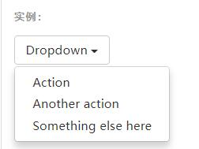

```html {.line-numbers}
<div class="dropdown">
  <button class="btn btn-default dropdown-toggle" type="button" id="dropdownMenu1" data-toggle="dropdown" aria-haspopup="true" aria-expanded="true">
    Dropdown
    <span class="caret"></span>
  </button>
  <ul class="dropdown-menu" aria-labelledby="dropdownMenu1">
    <li><a href="#">Action</a></li>
    <li><a href="#">Another action</a></li>
    <li><a href="#">Something else here</a></li>
    <li role="separator" class="divider"></li>
    <li><a href="#">Separated link</a></li>
  </ul>
</div>
```

* 通过为下拉菜单的父元素设置 .dropup 类，可以让菜单向上弹出（默认是向下弹出的）。
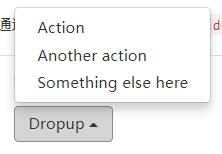

### 对齐
* 默认情况下，下拉菜单自动沿着父元素的上沿和左侧被定位为 100% 宽度。 为 .dropdown-menu 添加 .dropdown-menu-right 类可以让菜单右对齐。

```html {.line-numbers}
<ul class="dropdown-menu dropdown-menu-right" aria-labelledby="dLabel">
  ...
</ul>
```

### 标题
* 在任何下拉菜单中均可通过添加标题来标明一组动作。
    `class="dropdown-header"`
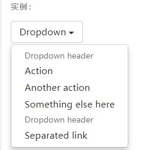

```html {.line-numbers}
<ul class="dropdown-menu" aria-labelledby="dropdownMenu3">
  ...
  <li class="dropdown-header">Dropdown header</li>
  ...
</ul>
```
### 分割线
* 为下拉菜单添加一条分割线，用于将多个链接分组。
   ` class="divider"`

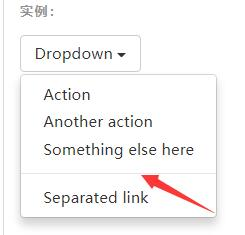
```html {.line-numbers}
<ul class="dropdown-menu" aria-labelledby="dropdownMenuDivider">
  ...
  <li role="separator" class="divider"></li>
  ...
</ul>
```

### 禁用的菜单项
* 为下拉菜单中的 `<li>`元素添加 `.disabled `类，从而禁用相应的菜单项。

## 三、按钮组
     通过按钮组容器把一组按钮放在同一行里。通过与按钮插件联合使用，可以设置为单选框或多选框的样式和行为。

* 确保设置正确的 role 属性并提供一个 label 标签
    * 对于按钮组合，应该是 role="group"，对于toolbar（工具栏）应该是 role="toolbar"。

### 基本实例  `.btn-group`
* 在按钮组最外层使用

    `class="btn-group" role="group" `
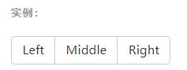

    ```html {.line-numbers}
    <div class="btn-group" role="group" aria-label="...">
    <button type="button" class="btn btn-default">Left</button>
    <button type="button" class="btn btn-default">Middle</button>
    <button type="button" class="btn btn-default">Right</button>
    </div>
    ```
### 按钮工具栏 `.btn-toolbar`
* 把一组 `<div class="btn-group">` 组合进一个 `<div class="btn-toolbar"> `中就可以做成更复杂的组件。

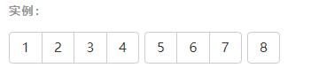

```html {.line-numbers}
<div class="btn-toolbar" role="toolbar" aria-label="...">
    <div class="btn-group" role="group" aria-label="...">...</div>
    <div class="btn-group" role="group" aria-label="...">...</div>
    <div class="btn-group" role="group" aria-label="...">...</div>
</div>
```
### 尺寸  `.btn-group-lg `=>`lg` |`md`|`sm`|`xs`

* 只要给 .btn-group 加上 .btn-group-* 类，就省去为按钮组中的每个按钮都赋予尺寸类了，如果包含了多个按钮组时也适用`
* `*`用`lg`,`md`,`sm`,`xs`代替

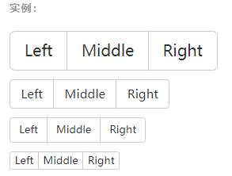

```html {.line-numbers}
 <div class="btn-toolbar" role="toolbar" aria-label="...">
    <div class="btn-group" role="group" aria-label="...">
        <button type="button" class="btn btn-default">Left</button>
        <button type="button" class="btn btn-default">Middle</button>
        <button type="button" class="btn btn-default">Right</button>
        <div type="button" class="btn btn-group btn-default" role="group" aria-label="...">按钮1</div>
        <div type="button" class="btn btn-group btn-default" role="group" aria-label="...">按钮1</div>
        <div type="button" class="btn btn-group btn-default" role="group" aria-label="...">按钮1</div>
    </div>
        </div>
```

### 嵌套
*想要把下拉菜单混合到一系列按钮中，只须把 `.btn-group `放入另一个 `.btn-group `中。

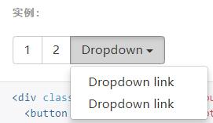

```html {.line-numbers}
<div class="btn-toolbar" role="toolbar" aria-label="...">
    <div class="btn-group" role="group" aria-label="...">
        <div class="btn-group" role="group" aria-label="...">
            <button type="button" class="btn btn-default">1</button>
            <button type="button" class="btn btn-default">2</button>
            <div class="btn-group" role="group">
                <button type="button" class="btn btn-default dropdown-toggle" data-toggle="dropdown"
                    aria-haspopup="true" aria-expanded="false">
                    Dropdown
                    <span class="caret"></span>
                </button>
                <ul class="dropdown-menu">
                    <li><a href="#">Dropdown link</a></li>
                    <li><a href="#">Dropdown link</a></li>
                </ul>
            </div>
        </div>
    </div>
</div>
```
### 垂直排列 `.btn-group-vertical`

* 让一组按钮垂直堆叠排列显示而不是水平排列。*分列式按钮下拉菜单不支持这种方式。*
* 按钮组垂直排列

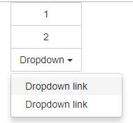

<div class="btn-group-vertical" role="group" aria-label="...">
  ...
</div>

### 两端对齐排列的按钮组 `btn-group-justified`
* 关于边框的处理
    *两个按钮之间的边框叠加。在普通的按钮组中，margin-left: -1px 用于将边框重叠，而没有删除任何一个按钮的边框。
* margin 属性不支持 display: table-cell。因此，根据你对 Bootstrap 的定制，你可以删除或重新为按钮的边框设置颜色。*
* IE8 和边框
    * Internet Explorer 8 不支持在两端对齐的按钮组中绘制边框，无论是 `<a> `或 `<button> `元素。为了照顾 IE8，把每个按钮放入另一个 .btn-group 中即可。

* **关于 `<a> `元素**
    * 只须将一系列 .btn 元素包裹到 `.btn-group``.btn-group-justified` 中即可。*

* **关于` <button>` 元素**
    * 为了将` <button>` 元素用于两端对齐的按钮组中，必须将每个按钮包裹进一个按钮组中

## 按钮式下拉菜单
* 把任意一个按钮放入 .btn-group 中，然后加入适当的菜单标签，就可以让按钮作为菜单的触发器了。
* 插件依赖
    * 按钮式下拉菜单依赖下拉菜单插件 ，因此需要将此插件包含在你所使用的 Bootstrap 版本中
### 单按钮下拉菜单 `<span class="caret"></span>`

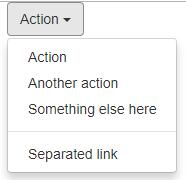
```html {.line-numbers}
 <div class="btn-group">
    <button type="button" class="btn btn-default dropdown-toggle" data-toggle="dropdown" aria-haspopup="true" aria-expanded="false">
        Action <span class="caret"></span>
    </button>
        <ul class="dropdown-menu">
            <li><a href="#">Action</a></li>
            <li><a href="#">Another action</a></li>
            <li><a href="#">Something else here</a></li>
            <li role="separator" class="divider"></li>
            <li><a href="#">Separated link</a></li>
        </ul>
</div>
```

### 分裂式按钮下拉菜单
* 只是多一个分开的按钮。

### 按钮下拉菜单尺寸 `btn-lg` sm|xs`

* 按钮式下拉菜单适用所有尺寸的按钮。

### 向上弹出式菜单 `.dropup`

## 输入框组

* 为`.input-group` 赋予 `.input-group-addon` 或 `.input-group-btn` 类，可以给 `.form-control` 的前面或后面添加额外的元素。
    * 只支持文本输入框 `<input>`
        *这里请避免使用` <select> `元素，因为 WebKit 浏览器不能完全绘制它的样式。*

        *避免使用` <textarea> `元素，由于它们的 rows 属性在某些情况下不被支持。*

## 导航 `.nav`

* **Bootstrap 中的导航组件都依赖同一个 .nav 类，状态类也是共用的。改变修饰类可以改变样式。**
* 在标签页上使用导航需要依赖 JavaScript 标签页插件
* 务必在 `<ul>` 的最外侧的逻辑父元素上添加 `role="navigation"` 属性
* 或者用一个 `<nav>`元素包裹整个导航组件

### 标签页 `.nav-tabs`

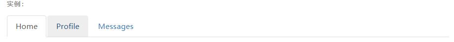
     
* .nav-tabs 类依赖 .nav 基类。

```html {.line-numbers}
 <ul class="nav nav-tabs">
  <li role="presentation" class="active"><a href="#">Home</a></li>
  <li role="presentation"><a href="#">Profile</a></li>
  <li role="presentation"><a href="#">Messages</a></li>
</ul>
```
### 胶囊式标签页  `.nav-pills`

* 水平方向 `.nav-pills`
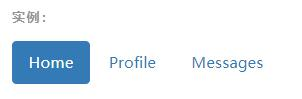

* 胶囊是标签页也是可以垂直方向堆叠排列的。只需添加 .nav-stacked 类。
    * 垂直方向 `.nav-stacked`
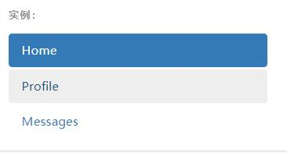

### 两端对齐的标签页 `.nav-justified`

```html
<ul class="nav nav-tabs nav-justified">
  ...
</ul>
<ul class="nav nav-pills nav-justified">
  ...
</ul>
```
### 禁用的链接 `.disabled`

* 链接功能不受到影响
    * 这个类只改变 `<a>`标签的外观，不改变功能。可以自己写 JavaScript 禁用这里的链接。

### 添加下拉菜单

* 带下拉菜单的标签页

```html {.line-numbers}
<ul class="nav nav-tabs">
  ...
  <li role="presentation" class="dropdown">
    <a class="dropdown-toggle" data-toggle="dropdown" href="#" role="button" aria-haspopup="true" aria-expanded="false">
      Dropdown <span class="caret"></span>
    </a>
    <ul class="dropdown-menu">
      ...
    </ul>
  </li>
  ...
</ul>
```

### 带下拉菜单的胶囊式标签页
* 更改上面代码中最外层class 为 `nav-pills`

## 导航条

###导航条内所包含元素溢出
* 减少导航条内所有元素所占据的宽度。
* 在某些尺寸的屏幕上（利用 响应式工具类）隐藏导航条内的一些元素。
* 修改导航条在水平排列和折叠排列互相转化时，触发这个转化的最小屏幕宽度值。可以通过修改 @grid-float-breakpoint 变量实现，或者自己重写相关的媒体查询代码，覆盖 Bootstrap 的默认值。
### 依赖 JavaScript 插件
* 响应式导航条依赖 collapse `(.navbar-collapse )`插件，定制 Bootstrap 的话时候必将其包含。
* 修改视口的阈值，从而影响导航条的排列模式
### 导航条的可访问性
务必使用 <nav> 元素，或者，如果使用的是通用的 <div> 元素的话，务必为导航条设置 role="navigation" 属性，这样能够让使用辅助设备的用户明确知道这是一个导航区域。

### 表单 `.navbar-form`

* 将表单放置于 .navbar-form 之内可以呈现很好的垂直对齐,并在较窄的视口（viewport）中呈现折叠状态。 使用对齐选项可以规定其在导航条上出现的位置。

* **为输入框添加 label 标签**
    * 如果你没有为输入框添加 label 标签，屏幕阅读器将会遇到问题。对于导航条内的表单，可以通过添加 .sr-only 类隐藏 label 标签。

### 按钮 `.navbar-btn`

* 对于不包含在` <form> `中的` <button> `元素，加上 .navbar-btn 后，可以让它在导航条里垂直居中

###文本
* 把文本包裹在 `.navbar-text`中时，为了有正确的行距和颜色，通常使用 `<p>` 标签。

### 非导航的链接
* `.navbar-link`

### 组件排列
* `.navbar-left `
* `.navbar-right `

* 向右侧对齐多个组件
    * 导航条目前不支持多个 .navbar-right 类。为了让内容之间有合适的空隙，我们为最后一个 .navbar-right 元素使用负边距（margin）。如果有多个元素使用这个类，它们的边距（margin）将不能按照你的预期正常展现。
###  固定在底部 `.navbar-fixed-bottom`
### 固定在顶部 `.navbar-fixed-top`
* 添加 .navbar-fixed-top 类可以让导航条固定在顶部，还可包含一个 .container 或 .container-fluid 容器，从而让导航条居中，并在两侧添加内补（padding）。

```html {.line-numbers}
<nav class="navbar navbar-default navbar-fixed-top">
  <div class="container">
    ...
  </div>
</nav>
```
* 需要为 body 元素设置内补（padding）
    * 这个固定的导航条会遮住页面上的其它内容，除非你给` <body> `元素底部设置了` padding`。用你自己的值，或用下面给出的代码都可以。提示：导航条的默认高度是 **`50px`**。

### 静止在顶部 `.navbar-static-top`
* 通过添加 .navbar-static-top 类即可创建一个与页面等宽度的导航条，它会随着页面向下滚动而消失。还可以包含一个 .container 或 .container-fluid 容器，用于将导航条居中对齐并在两侧添加内补（padding）。

* __与.navbar-fixed-* 类不同的是，你不用给 body 添加任何内补（padding）。__

## 路径导航 `.breadcrumb`
* 各路径间的分隔符已经自动通过 CSS 的 :before 和 content 属性添加了

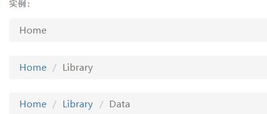
     
* .nav-tabs 类依赖 .nav 基类。

```html {.line-numbers}
    <ol class="breadcrumb">
        <li><a href="#">Home</a></li>
        <li><a href="#">Library</a></li>
        <li class="active">Data</li>
    </ol>
```

## 分页 `Page navigation`


### 默认分页
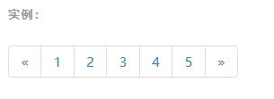
     

```html {.line-numbers}
    <nav aria-label="Page navigation">
  <ul class="pagination">
    <li>
      <a href="#" aria-label="Previous">
        <span aria-hidden="true">&laquo;</span>
      </a>
    </li>
    <li><a href="#">1</a></li>
    <li><a href="#">2</a></li>
    <li><a href="#">3</a></li>
    <li><a href="#">4</a></li>
    <li><a href="#">5</a></li>
    <li>
      <a href="#" aria-label="Next">
        <span aria-hidden="true">&raquo;</span>
      </a>
    </li>
  </ul>
</nav>
```

### 禁用和激活状态 
* 激活状态：`.active`
* 禁用状态：`.disabled`
* 链接在不同情况下可以定制。你可以给不能点击的链接添加 .disabled 类、给当前页添加 .active 类。
### 尺寸
* `.pagination-lg` 或 `.pagination-sm ` 类提供了额外可供选择的尺寸。

## 标签
* label label-default
```html
<h3>Example heading 
    <span class="label label-default">New</span>
</h3>`
```

### 如果标签数量很多怎么办？
* `display: inline-block`

## 徽章 `.badge`

* 给链接、导航等元素嵌套 `<span class="badge">` 元素，可以很醒目的展示新的或未读的信息条目。
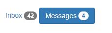
     

```html {.line-numbers}
<a href="#">Inbox <span class="badge">42</span></a>
<button class="btn btn-primary" type="button">Messages
     <span class="badge">4</span>
</button>
```
## 页头   `.page-header`

## 缩略图 `.thumbnail`

* 通过缩略图组件扩展 Bootstrap 的 栅格系统，可以很容易地展示栅格样式的图像、视频、文本等内容。

```html {.line-numbera}
<div class="row">
    <div class="col-xs-6 col-md-3">
            <a href="#" class="thumbnail">
                
            </a>
    </div>
  ...
</div>
```

### 自定义内容
* 添加一点点额外的标签，就可以把任何类型的 HTML 内容，例如标题、段落或按钮，加入缩略图组件内。
    * 类似于dl>dt>dd

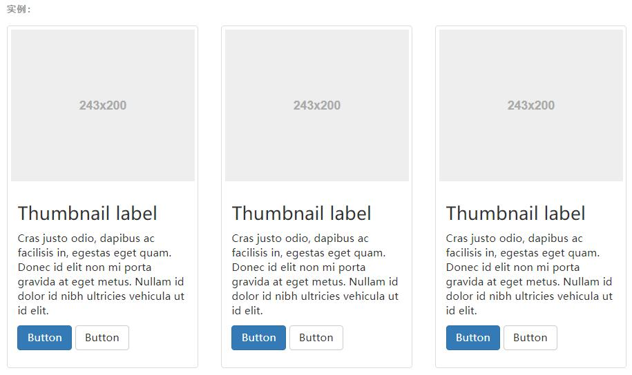
     

```html {.line-numbers}
<div class="row">
  <div class="col-sm-6 col-md-4">
    <div class="thumbnail">
      
      <div class="caption">
        <h3>Thumbnail label</h3>
        <p>...</p>
        <p><a href="#" class="btn btn-primary" role="button">Button</a> <a href="#" class="btn btn-default" role="button">Button</a></p>
      </div>
    </div>
  </div>
</div>
```

## 进度条 `.progress`

### 基本实例
* 默认样式的进度条

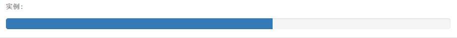
     

```html {.line-numbers}
<div class="progress">
  <div class="progress-bar" role="progressbar" aria-valuenow="60" aria-valuemin="0" aria-valuemax="100" style="width: 60%;">
    <span class="sr-only">60% Complete</span>
  </div>
</div>
```

### 带有提示标签的进度条
*  将设置了 `.sr-only `类的` <span>` 标签从进度条组件中移除 类，从而让当前进度显示出来。

### 根据情境变化效果
 * `progress-bar progress-bar-success`**info** **warning** **danger** **primary**
    * `progress-bar progress-bar-info`
    * `progress-bar progress-bar-warning`
    * `progress-bar progress-bar-danger`

### 条纹效果  `.progress-bar-striped`

### 堆叠效果
* 把多个进度条放入同一个 .progress 中，使它们呈现堆叠的效果。

## 媒体对象
* **对评论或文章列表很有用**
* 默认样式
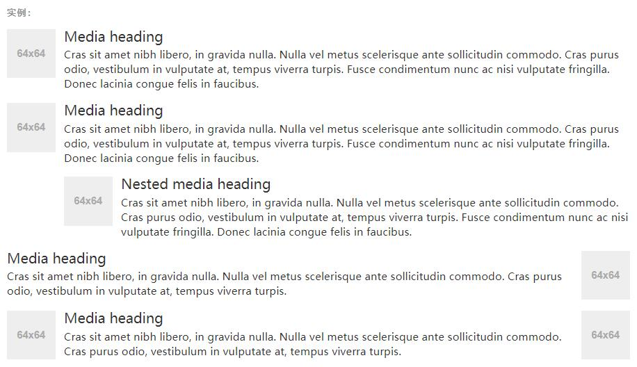
     

```html {.line-numbers}
<div class="media">
    <div class="media-left">
        <a href="#">
            
        </a>
    </div>
    <div class="media-body">
        <h4 class="media-heading">Media heading</h4>
        ...
    </div>
</div>
```

## 列表组
* list-group 父级
* list-group-item 包裹的每一子项
* 列表组是灵活又强大的组件，不仅能用于显示一组简单的元素，还能用于复杂的定制的内容。
### 基本实例

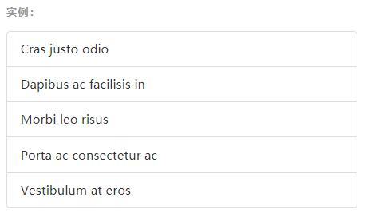
     
```html {.line-numbers}
<ul class="list-group">
  <li class="list-group-item">Cras justo odio</li>
  <li class="list-group-item">Dapibus ac facilisis in</li>
  <li class="list-group-item">Morbi leo risus</li>
  <li class="list-group-item">Porta ac consectetur ac</li>
  <li class="list-group-item">Vestibulum at eros</li>
</ul>
```
* 可以加 徽章：` <span class="badge">14</span>`

### 链接
* 用 `<a>` 标签代替` <li> `标签可以组成一个全部是链接的列表组（还要注意的是，我们需要将 `<ul>` 标签替换为` <div> `标签）。没必要给列表组中的每个元素都加一个父元素。

```html {.line-numbers}
<div class="list-group">
  <a href="#" class="list-group-item active">
    Cras justo odio
  </a>
  <a href="#" class="list-group-item">Dapibus ac facilisis in</a>
  <a href="#" class="list-group-item">Morbi leo risus</a>
  <a href="#" class="list-group-item">Porta ac consectetur ac</a>
  <a href="#" class="list-group-item">Vestibulum at eros</a>
</div>
```
