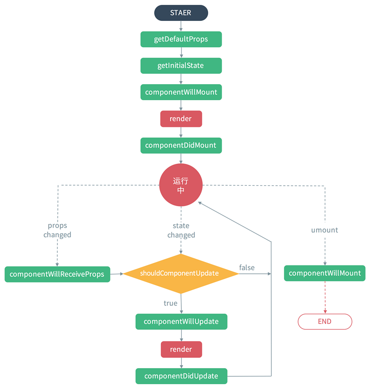

# 新的生命周期
## Mounting（加载阶段：涉及4个钩子函数）
### constructor()
### static getDerivedStateFromProps(props, state)
 * `组件每次被rerender的时候，包括在组件构建之后(虚拟dom之后，实际dom挂载之前)，每次获取新的props或state之后；每次接收新的props之后都会返回一个对象作为新的state，返回null则说明不需要更新state；配合componentDidUpdate，可以覆盖componentWillReceiveProps的所有用法`
### render()
### componentDidMount()

## Updating（更新阶段：涉及5个钩子函数)

### static getDerivedStateFromProps(props, state)
### shouldComponentUpdate(nextProps, nextState)
### render()

### getSnapshotBeforeUpdate(prevProps, prevState)
* `触发时间: update发生的时候，在render之后，在组件dom渲染之前；返回一个值，作为componentDidUpdate的第三个参数；配合componentDidUpdate, 可以覆盖componentWillUpdate的所有用法`
### componentDidUpdate()

## Unmounting（卸载阶段：涉及1个钩子函数）

## Error Handling(错误处理)
### componentDidCatch(error，info)
* `任何一处的javascript报错会触发`

<!--  -->

> React16新的生命周期弃用了componentWillMount、componentWillReceivePorps，componentWillUpdate
新增了getDerivedStateFromProps、getSnapshotBeforeUpdate来代替弃用的三个钩子函数（componentWillMount、componentWillReceivePorps，componentWillUpdate）
React16并没有删除这三个钩子函数，但是不能和新增的钩子函数（getDerivedStateFromProps、getSnapshotBeforeUpdate）混用，React17将会删除componentWillMount、componentWillReceivePorps，componentWillUpdate
新增了对错误的处理（componentDidCatch）

